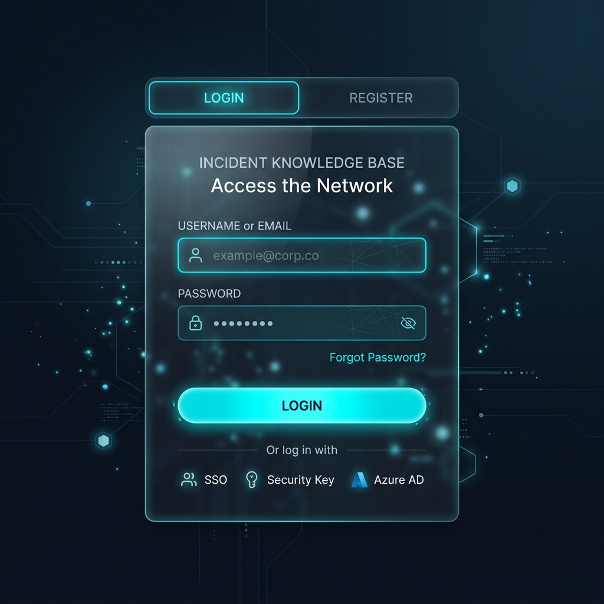
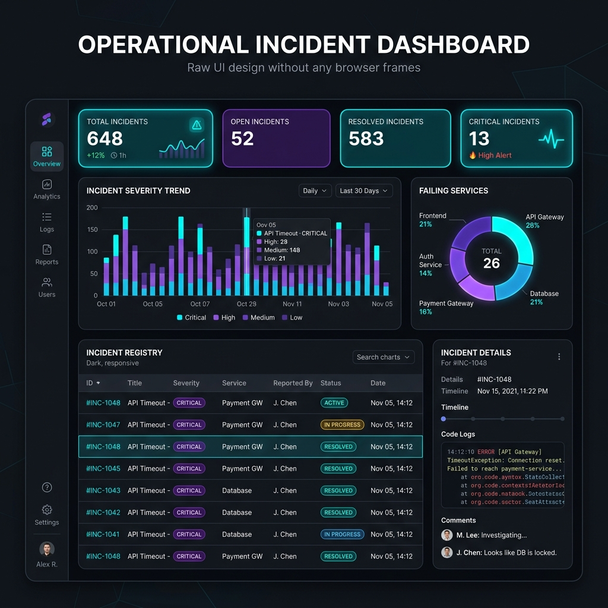

# Incident Knowledge Base & Root Cause Analyzer

A premium, modern Spring Boot 3 platform for incident reporting, operational intelligence, search, root-cause knowledge reuse, collaboration, notification, and dashboard analytics.

---

## 📸 User Interface Screenshots

### Login & Registration Portal
This secure portal supports JWT-based authentication. Users can sign in or register a new `ENGINEER` account.


### Incident Management & Analytics Dashboard
A full-featured command center displaying statistics cards, interactive graphs (severity and application fault metrics), a searchable incident registry, raw system logs, and live collaboration threads.


---

## 🛠️ Technology Stack

* **Backend Framework:** Java 17, Spring Boot 3, Spring Web
* **Database:** Spring Data MongoDB (leveraging Mongo text-search indexes)
* **Security:** Spring Security + JSON Web Token (JWT) auth
* **Utilities:** Bean Validation, Project Lombok, Springdoc OpenAPI (Swagger)
* **Frontend:** Clean modern HTML5, Vanilla CSS3, Javascript (ES6), Bootstrap 5, Chart.js
* **Containers:** Docker & Docker Compose v5

---

## 🚀 Quick Start (Run Locally)

### 1. Requirements
* Docker & Docker Compose installed and running.

### 2. Start the Application & Database
From the project root directory, launch the services in detached mode:
```bash
docker compose up --build -d
```

### 3. Access URLs
* **Web Application UI:** [http://localhost:8080](http://localhost:8080)
* **Interactive API Documentation (Swagger UI):** [http://localhost:8080/swagger-ui.html](http://localhost:8080/swagger-ui.html)
* **Raw OpenAPI Docs:** [http://localhost:8080/v3/api-docs](http://localhost:8080/v3/api-docs)

---

## 🗄️ Database & Schema Details

This project uses a decoupled document design to optimize performance and prevent document bloat in MongoDB:

### Collections Schema:
1. **`users`**: Manages member logins, roles, and profiles.
2. **`incidents`**: Houses main incident metadata (title, application, status, severity, tags).
3. **`logs`**: Log streams are stored separately in the `logs` collection and reference `incidentId` directly to ensure high performance and small document footprints.
4. **`comments`**: Manages interactive collaborative engineer comments for each incident.
5. **`notifications`**: Stores email/app notification dispatches.

### MongoDB Search Indexing
Incidents are indexed using MongoDB **Text Index** to provide fast, fuzzy search results rather than slow, resource-heavy regular expression (regex) table scans. Text indexing weights are defined as:
* **Title:** Weight 5
* **Error Message:** Weight 5
* **Application Name:** Weight 4
* **Root Cause:** Weight 3
* **Solution:** Weight 3
* **Tags:** Weight 2

---

## 🔒 Configuration & Environment Variables

Important configuration variables are defined in the `.env.example` file and loaded by Docker Compose:

| Variable | Description | Default / Example |
| :--- | :--- | :--- |
| `MONGODB_URI` | Connection string for MongoDB | `mongodb://localhost:27017/incident_kb` |
| `JWT_SECRET` | Secret key for signing JSON Web Tokens | *(Must be at least 32 bytes/256 bits)* |
| `JWT_ACCESS_TOKEN_TTL` | Lifespan of JWT access token (ISO-8601 Duration) | `PT15M` (15 minutes) |
| `JWT_REFRESH_TOKEN_TTL` | Lifespan of JWT refresh token (ISO-8601 Duration) | `P7D` (7 days) |
| `CORS_ALLOWED_ORIGINS` | Permitted cross-origin endpoints | `http://localhost:8080` |
| `BOOTSTRAP_ADMIN_ENABLED` | Seed default admin user on boot | `false` |
| `BOOTSTRAP_ADMIN_NAME` | Default admin display name | `Admin` |
| `BOOTSTRAP_ADMIN_EMAIL` | Default admin email address | `admin@incidentkb.com` |
| `BOOTSTRAP_ADMIN_PASSWORD`| Default admin password | `SecurePassword123` |

---

## 🛣️ API Endpoint Overview

### 🔑 Authentication (`/api/auth`)
* `POST /api/auth/register` - Registers a new `ENGINEER` user account.
* `POST /api/auth/login` - Authenticates user credentials and returns access & refresh tokens.
* `POST /api/auth/refresh` - Generates a new access token using a valid refresh token.

### 🛡️ User Administration (`/api/users` - Admin Gated)
* `GET /api/users/me` - Retrieves the profile of the current authenticated user.
* `GET /api/users` - Lists all registered users (Admin-only).
* `POST /api/users` - Creates users with explicit roles (`ENGINEER` or `ADMIN`) (Admin-only).
* `DELETE /api/users/{id}` - Deletes a user account (Admin-only).

### 📋 Incident Tracking (`/api/incidents`)
* `GET /api/incidents` - Lists, searches, and filters incident reports.
* `POST /api/incidents` - Files a new incident.
* `GET /api/incidents/{id}` - Inspects details of a single incident.
* `PUT /api/incidents/{id}` - Updates incident status, root cause, or solution.
* `DELETE /api/incidents/{id}` - Deletes an incident (Admin-only).

### 💬 Collaborations (`/api/incidents/{incidentId}/comments`)
* `GET /api/incidents/{incidentId}/comments` - Retrieves the comment thread for a specific incident.
* `POST /api/incidents/{incidentId}/comments` - Posts a new comment to the thread.

### 📊 Reports & Intelligence (`/api/dashboard` & `/api/knowledge`)
* `GET /api/dashboard` - Computes and returns statistics and chart configurations.
* `GET /api/knowledge/similar` - Suggests similar historical incidents based on text similarity and tags.

---

## 🔧 Important Troubleshooting Notes

### ⏰ ISO-8601 Duration Formatting Error
In Java, `java.time.Duration.parse()` resolves durations strictly using ISO-8601 specifications. 
* ❌ **Invalid Syntax:** `PT7D` (The `T` designator stands for time. Placing date markers like `D` after `T` throws a `DateTimeParseException`).
*   **Correct Syntax:** `P7D` (Since days belong to the Date component, they must precede `T`).
* **Fix:** If you get a startup binding failure on `JWT_REFRESH_TOKEN_TTL`, ensure the value is set to `P7D` or `PT168H` rather than `PT7D`.
